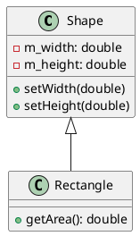

# Einführung in UML (Unified Modeling Language)

Die Unified Modeling Language (UML) ist eine standardisierte grafische Sprache zur Visualisierung, Spezifikation, Konstruktion und Dokumentation von Software-Systemen. UML wird häufig in der objektorientierten Softwareentwicklung eingesetzt, um Strukturen und Abläufe übersichtlich darzustellen.

---

## Wozu dient UML?

- **Visualisierung**: Komplexe Systeme werden verständlich und übersichtlich dargestellt.
- **Kommunikation**: Entwickler, Architekten und andere Beteiligte sprechen eine gemeinsame Sprache.
- **Dokumentation**: UML-Diagramme dienen als Teil der Projektdokumentation.
- **Analyse & Design**: Unterstützung bei der Planung und beim Entwurf von Software.

---

## Wichtige UML-Diagrammtypen

### 1. Klassendiagramm

- Zeigt Klassen, Attribute, Methoden und Beziehungen (z.B. Vererbung, Assoziation).
- Beispiel:

```text
+----------------+
|   Shape        |
+----------------+
| - m_width      |
| - m_height     |
+----------------+
| +setWidth()    |
| +setHeight()   |
+----------------+
        ^
        |
+----------------+
| Rectangle      |
+----------------+
| +getArea()     |
+----------------+
```

### 2. Objektdiagramm

- Zeigt konkrete Instanzen (Objekte) und deren Beziehungen zu einem bestimmten Zeitpunkt.

### 3. Sequenzdiagramm

- Stellt den zeitlichen Ablauf von Nachrichten (Methodenaufrufen) zwischen Objekten dar.

### 4. Anwendungsfalldiagramm (Use Case)

- Zeigt die Funktionalität eines Systems aus Sicht der Benutzer (Akteure).

### 5. Aktivitätsdiagramm

- Beschreibt Abläufe und Workflows (ähnlich Flussdiagrammen).

---

## Beispiel: UML-Klassendiagramm für Shape und Rectangle



---

## Tools für UML

- **PlantUML**: Textbasierte UML-Diagramme, einfach in Markdown oder Code einzubinden.
- **StarUML, Visual Paradigm, Lucidchart**: Grafische Tools für UML-Diagramme.
- **VS Code Extensions**: Es gibt Erweiterungen für UML und PlantUML.

---

## Weiterführende Links

- [UML Übersicht (Wikipedia)](https://de.wikipedia.org/wiki/Unified_Modeling_Language)
- [PlantUML Online Editor](https://www.plantuml.com/plantuml/uml/)
- [UML-Diagrammtypen (englisch)](https://www.uml-diagrams.org/)
